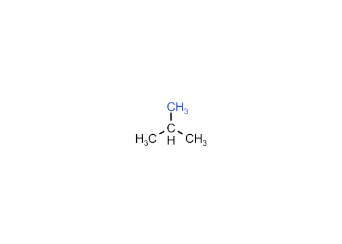
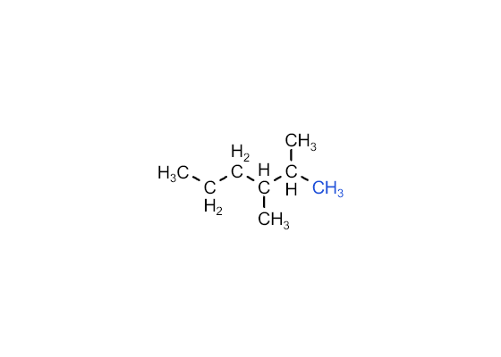
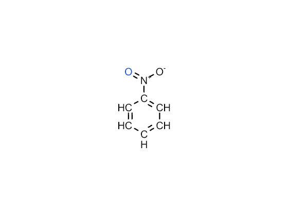
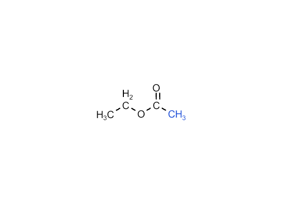

# ChemName Visualizer · 有机化学命名可视化教学工具

> 输入中文系统命名（或常见俗名）→ 自动解析并生成结构式，提供**分步解析动画、错误诊断、反向命名练习、等效氢与氢谱分析、同分异构体浏览、官能团高亮、碳链编号动画、顺反/手性判定、官能团转化路线图**等教学辅助功能。
>
> 面向高中化学一对一网课与课堂投屏场景。**完全离线**：零 CDN、零外部 API，所有计算在浏览器本地完成，断网可用。






---

## 功能清单

| 模块 | 说明 |
|---|---|
| **名称 → 结构** | 输入中文命名（如「2-甲基丙烷」「苯甲酸甲酯」）→ 三视图：完整结构式 / 结构简式 / 键线式 + 分子式；**四步分步解析动画**（识别母体 → 编号定位 → 识别取代基 → 补氢检查），每步带「为什么」规则条文与重播；**错误诊断**（如 3-甲基丁烷 → 提示并给出 2-甲基丁烷，并排对比错误/正确结构） |
| **反向练习** | L1–L7 分级题库（92 题）随机出题不重复；答案经 RDKit 结构比对（支持俗名等价）；3 次尝试；错误反馈具体到母体/编号/位置/名称/倍数词/官能团；练习统计与错题本（LocalStorage） |
| **同分异构体浏览器** | 内置 16 组 / 96 条异构体数据集 + 条件枚举（按分子式/官能团约束穷举，WL 图签名去重） |
| **等效氢 / 氢谱** | WL 迭代细化图签名计算等效氢类数；简化氢谱模拟（固定化学位移代表值，峰高 ∝ 氢数），附「查看氢谱」引导按钮 |
| **官能团高亮** | SMARTS 子结构匹配，目标官能团红色高亮、其余原子置灰 |
| **顺反 / 手性判定** | C=C 双键顺反异构判定；手性中心（四面体）判定与提示 |
| **碳链编号动画** | 最长链 → 双方向编号 → 位次和最小 → 最优方案，逐步演示教材编号规则 |
| **官能团转化路线图** | 分层卡片流（按氧化态分 4 层），展示常见官能团间的转化路线与反应条件 |
| **导出** | 结构图 PNG/SVG（背景/氢/编号/分辨率选项）；四步分步截图包 ZIP（可直接插入 PPT）；练习报告 CSV/TXT（UTF-8 BOM，Excel 兼容） |

## 完全离线

- **零 CDN、零外部 API**：RDKit.js（WebAssembly）与 Kekule.js 均为本地 npm 包，WASM 由构建脚本复制到 `public/` 后随应用打包；
- 所有化学计算（命名解析、图构建、对称性分析、异构枚举）都在浏览器本地完成；
- 断网验证方法：① 断开网络 → ② 用本地服务器打开 `dist/` → ③ 开发者工具 Network 面板确认无任何外部请求。

## 快速开始

要求：Node.js ≥ 18。

```bash
npm install        # 安装依赖（predev/prebuild 自动把 RDKit wasm 复制到 public/）
npm run dev        # 开发调试 → http://localhost:5173
```

### 生产构建与离线部署

```bash
npm run build      # 产物输出到 dist/
cd dist
python -m http.server 8080     # 或 Live Server / 任意静态服务器
```

打开 http://localhost:8080 即可使用。**注意**：WebAssembly 需经 HTTP 协议加载，请用本地 HTTP 服务器打开（Live Server、`python -m http.server` 均可），不要直接双击 `index.html`（file:// 协议会被浏览器拦截 wasm）。

## 测试

```bash
npm test           # 850 项单元/验收测试，31 个测试文件（vitest）
```

覆盖：中文命名解析全量示例、结构构建与 RDKit 规范化一致性、反向命名、错误诊断、等效氢（含验收 6 分子：乙醇 3 类 / 甲苯 4 类 / 对二甲苯 2 类 / 乙酸乙酯 3 类 / 丙酮 1 类 / 丙炔 2 类）、同分异构体数量、顺反/手性、结构简式生成、高考语料库（122 条 / 10 类覆盖）等。

**枚举锚点（测试锁定）**：C8H10O = 15（酚 9 + 芳香醚 4 + 芳香醇 2）、C4H9Cl = 4、C5H12 = 3、C6H14 = 5、C9H20 = 35、C10H22 = 75。

## 架构

```
┌─────────────────────────────────────────────────────────────┐
│  展示层  src/components + src/store/AppContext              │
│  （纯 UI：面板/渲染/导出；不写化学算法）                       │
├─────────────────────────────────────────────────────────────┤
│  应用层  src/core/naming（lexicon/parser/builder/pipeline/   │
│          diagnostics/tutorial）、src/core/practice/judge、   │
│          src/core/reverse/namer（结构 → 中文名）              │
├─────────────────────────────────────────────────────────────┤
│  引擎层  src/core/chem（graph/symmetry/geometric/chirality/  │
│          isomerEnum/nmr/condensed/fgroups）                  │
│          + src/core/rdkit.ts / src/core/kekule.ts（封装）     │
└─────────────────────────────────────────────────────────────┘
```

**关键架构决策**

1. **三层严格分层**：展示层不写化学算法，算法层不碰 DOM；
2. **自研分子图引擎优先**：命名解析、构建、对称性、异构枚举全部基于自研图结构（`src/core/chem/graph.ts`），**不经 RDKit 也能完整工作**；RDKit 仅作 canonical 校验裁判；
3. **WL 图细化一石四鸟**：同一套有界整数重标号图签名同时服务等效氢/顺反/手性判定与异构去重；
4. **教材式命名**：遵循高中人教版教材命名规则（非严格 IUPAC），超出词表给出友好提示而非错名。

## 化学知识范围声明

- **教材基础层**：烷/烯/炔、卤代烃、醇/酚/醚、醛/酮、羧酸/酯、常见芳香族（苯及取代苯、联苯类、萘/蒽等稠环）、常见俗名（如甲苯、苯酚、乙酸乙酯）；
- **考试适配层**：等效氢、一氯代物种类数、顺反异构、手性中心、同分异构体计数等高考常考分析维度；
- 命名采用**教材式命名约定**（非严格 IUPAC），如位次编号以位次和最小为准、取代基按教材次序规则排序；
- 规则条文与教学文案为项目自撰表述，未引用教材原文。

## 已知限制

- 氢谱为**教学简化模拟**：固定化学位移代表值、峰高 ∝ 氢数，未做耦合分裂；
- 稠环芳烃（萘/蒽/菲等）的正向命名支持有限，结构层分析（等效氢等）正确；
- 反向命名器对**超出词表**的结构（如桥环）返回报错而非输出错误名称（系统化防错策略）；
- Z/E 标注、双糖等超出教材范围的结构层分析不支持；
- 建议使用现代 Chromium / Edge 浏览器；屏幕共享场景已做投屏适配（字号 ≥14px、按钮热区、画布最小高度）。

## 目录结构

```
src/
  core/            # 化学引擎封装（rdkit/kekule）、命名解析（parser/builder/namer/
                   # diagnostics/tutorial/pipeline）、图结构（graph/symmetry/nmr/
                   # condensed/fgroups/geometric/chirality/isomerEnum）、存储、导出
  data/            # 题库（92 题）、异构体数据集（16 组/96 条）、转化路线网络、官能团示例
  components/      # 名称解析面板、练习面板、教学工具（异构体/等效氢/氢谱/官能团高亮/
                   # 编号动画/顺反手性/转化路线图）、导出面板、结构查看器
  store/           # 全局状态（AppContext）
tests/             # 850 项单元与验收测试（含高考语料库 highschool-corpus.data.ts）
scripts/           # copy-assets（构建时复制 RDKit wasm 到 public/）
```

## 技术栈

- React 18 + Vite 6 + Tailwind CSS 4 + TypeScript 5.6（strict）
- **Kekule.js 1.0.4**（npm 本地引入）—— 化学结构渲染（封装于 `src/core/kekule.ts`）
- **RDKit.js 2025.3.4**（WebAssembly，`public/RDKit_minimal.wasm` 本地加载，封装于 `src/core/rdkit.ts`）
- JSZip（本地 ZIP 导出）、LocalStorage（练习记录/错题本/设置）
- 图标为内联 SVG/Unicode，字体为系统字体栈

## 贡献指南

欢迎提交 Issue 与 PR：

1. Fork 本仓库并克隆到本地；
2. `npm install && npm run dev` 本地调试；
3. 修改代码后运行 `npm test`（850 项）与 `npx tsc --noEmit`，全部通过后提交 PR；
4. 新增化学命名/题库/语料能力时，请在 `tests/` 补对应回归用例（可参考 `tests/highschool-corpus.data.ts` 的数据驱动写法）；
5. 涉及教学文案时请保持原创表述（不引用教材原文）。

## 许可证

[MIT](./LICENSE)。第三方依赖（RDKit.js：BSD-3-Clause；Kekule.js/React/Vite/Tailwind 等：MIT）见 [THIRD_PARTY_NOTICES.md](./THIRD_PARTY_NOTICES.md)。
